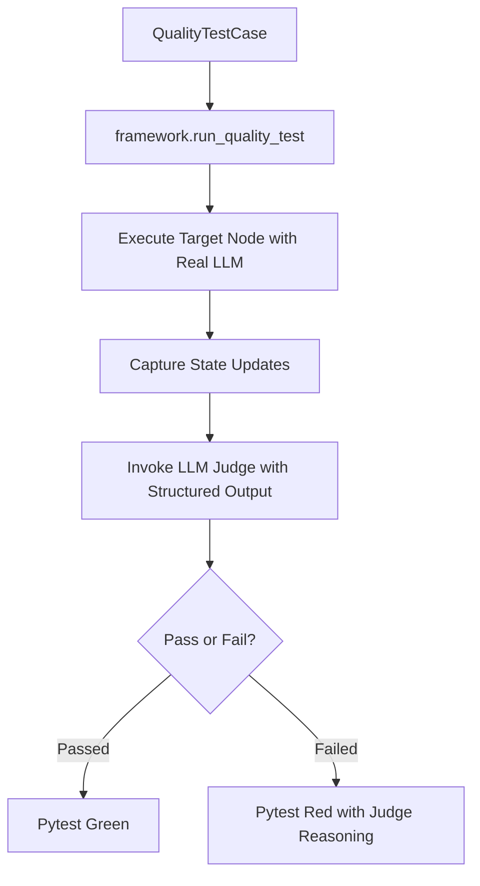

# 🧠 LLM-as-a-Judge Quality Testing Framework

This directory contains a specialized quality testing framework designed to evaluate non-deterministic AI decisions, routing, and conversation nodes (e.g. `orchestrator`, `chatbot`, `clarifier`, `worker`) in LangGraph.

Instead of writing strict assertion tests (which fail often on small textual changes), we use a structured **LLM Judge** (`gpt-4o-mini`) to evaluate the outputs against a natural language criterion.

---

## 🚀 How to Run Quality Tests

Since quality tests invoke real LLM calls and consume API tokens, they are marked with a custom pytest mark `@pytest.mark.quality`.

To run only the quality tests:
```bash
# Make sure your virtual env is active and API keys are set in backend/.env
.venv\Scripts\python -m pytest tests/QualityTests -v
```

To run a specific test case:
```bash
.venv\Scripts\python -m pytest tests/QualityTests -k "orchestrator_routes_to_worker_on_clear_task" -v
```

---

## 🛠️ How to Add a New Test

Adding a test is designed to be **super easy and declarative**. You do not need to write any test functions or mock setup logic.

1. Open [test_cases.py](file:///e:/ran/Projects/Atom/backend/tests/QualityTests/test_cases.py).
2. Append a new `QualityTestCase` instance to the `QUALITY_TEST_CASES` list:

```python
from langchain_core.messages import HumanMessage
from tests.QualityTests.framework import QualityTestCase

# Add your case to the list:
QualityTestCase(
    name="my_custom_chatbot_test",
    node="chatbot",
    messages=[
        HumanMessage(content="Hello! Please explain what Atom is.")
    ],
    eval_criteria=(
        "The response must be polite and mention that Atom is a coding assistant, "
        "without hallucinating unrelated tools."
    ),
    temperature=0.7 # optional, defaults to 0.0 (recommended for deterministic testing)
)
```

---

## 🏗️ How it Works Under the Hood



1. **Node Selection**: The framework maps the `node` parameter (e.g., `"orchestrator"`) to the actual node function.
2. **Node Execution**: The node is run asynchronously using a real `ChatOpenAI` instance initialized with the workspace's API keys.
3. **Structured Evaluation**: The system feeds the inputs, output state updates, and your natural language `eval_criteria` to a structured LLM judge.
4. **Assertive Reporting**: If the LLM judge sets `passed=False`, the test fails and prints the judge's detailed reasoning directly in your terminal.
