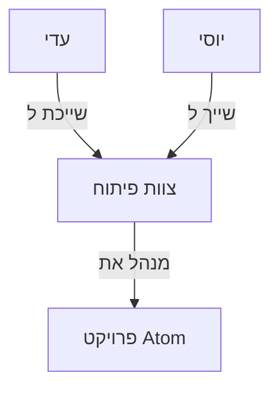

# יצירת Knowledge graph

גרף הידע (Knowledge Graph) הוא המקום שבו הנתונים והתהליכים שלכם מקבלים משמעות ויזואלית. במקום להביט בטבלאות נתונים שטוחות, המידע מוצג כרשת מקושרת של ישויות המראה את ההקשרים והחיבורים ביניהן בזמן אמת.

## איך זה עובד?

כל פריט מידע או ישות בגרף מיוצג על ידי עיגול או מלבן הנקרא **צומת (Node)**, והקשר בין שני פריטים מיוצג על ידי חץ מחבר הנקרא **קשת/קשר (Edge)**.

:::tip[דוגמה מעשית]

אם אנחנו מנהלים את צוות הפיתוח במערכת: 
- העובדת **עדי** תהיה צומת (Node) מסוג `User`.
- **צוות הפיתוח** יהיה צומת (Node) מסוג `Team`.
- החיבור ביניהם יהיה קשר (Edge) המוגדר כ-`Belongs To` (שייך ל...).

:::

### תרשים להמחשה

---

## ניווט בלוח הגרף (Interactive Canvas)

ממשק גרף הידע מציע לוח עבודה דינמי וקל לשימוש:
- **הזזה (Pan):** לחצו לחיצה ארוכה על רקע הלוח וגררו את העכבר כדי לנוע ברחבי הגרף.
- **זום (Zoom):** השתמשו בגלגלת העכבר (או במחוות צביטה במשטח המגע) כדי להתקרב או להתרחק.
- **חיפוש ישויות:** השתמשו בתיבת החיפוש בפינת המסך כדי לאתר במהירות צמתים לפי שמם או סוגם. הגרף יתמקד אוטומטית בצומת שנבחר.

---

## פעולות מרכזיות בממשק

### 1. הוספת צומת חדש (Add Node)
חלק מהנתונים יוזרמו אוטומטית מהאוטומציות, אך תוכלו ליצור אותם ידנית בכל עת:
1. במסך גרף הידע, לחצו על כפתור **+ הוסף צומת** (+ Add Node) בסרגל הכלים.
2. **סוג הצומת (Node Type):** בחרו את סוג הישות מתוך הרשימה (לדוגמה: `Project`, `Database`, `User`).
3. **מאפיינים (Properties):** הזינו את מאפייני הישות בטבלה המוצגת (למשל: שם הצומת, סטטוס, כתובת IP).
4. לחצו על **צור** (Create). הצומת החדש יופיע במרכז לוח הגרף שלכם.

### 2. יצירת קשרים בין צמתים (Create Edges)
כדי לקשר בין שתי ישויות בגרף:
1. סמנו בלחיצה את הצומת הראשון (ממנו יוצא הקשר).
2. גררו את אייקון החץ שמופיע בקצה הצומת לכיוון הצומת השני (אליו מגיע הקשר).
3. ברגע שתשחררו את הגרירה, ייפתח תפריט בחירה.
4. בחרו את סוג הקשר הרצוי (למשל: `Manages`, `Member Of`, `Connects To`).
5. אשרו את יצירת הקשר.

### 3. עריכת פרטי צומת או קשר
לחיצה כפולה על כל צומת או קשר בגרף תפתח **פאנל צדי (Side Panel)** מפורט:
- בפאנל זה תוכלו לראות את כל המאפיינים (Properties) וההיסטוריה של הישות.
- תוכלו לערוך ערכים קיימים, להוסיף מאפיינים חדשים או לשנות את צבע הצומת.

:::danger[אזהרת מחיקה]

מחיקת צומת מהגרף תמחוק באופן אוטומטי את כל הקשרים (Edges) שמחוברים אליו! ודאו שאינכם מוחקים מידע חיוני המקושר לתהליכים אחרים לפני ביצוע המחיקה.

:::
